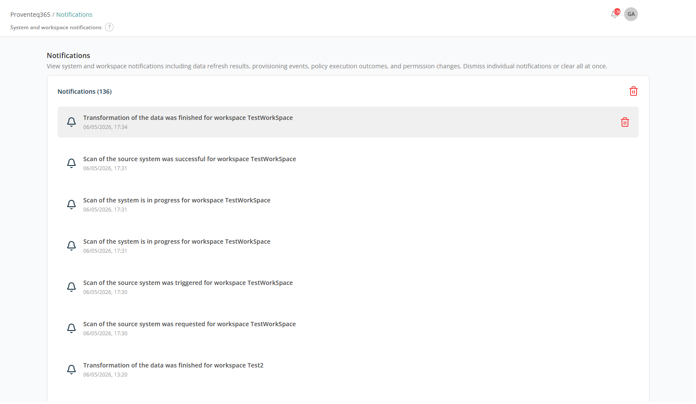

# Notification

The **Notifications** screen provides a centralised view of system-generated alerts and activity updates related to your Proventeq365 environment. It helps you monitor background processes, track execution status, and stay informed about key system events.

At the top of the screen, before your User Name, there is a **Bell** icon along with a count. Click the Bell icon to open the Notifications screen:

## Notification List

The main section displays a chronological list of notifications. Each notification includes:

- **Icon** — A bell icon indicating a system-generated notification.
- **Message** — A short description of the event or action.
- **Timestamp** — The date and time when the event occurred.
- **Delete Individual Notification** — Each notification includes a delete (trash) icon to remove a specific notification without affecting others.

The **delete (trash) icon** at the top right of the panel clears all notifications at once.

## Types of Notifications

You may see notifications for:

- **Scan Activities** — Requested, triggered, in progress, or completed scans of source systems.
- **Transformation Status** — Completion of data transformation processes.
- **Provisioning Events** — Workspace or resource setup activities.
- **Policy Execution** — Results of governance or compliance actions.
- **Permission Changes** — Updates to access or sharing settings.
