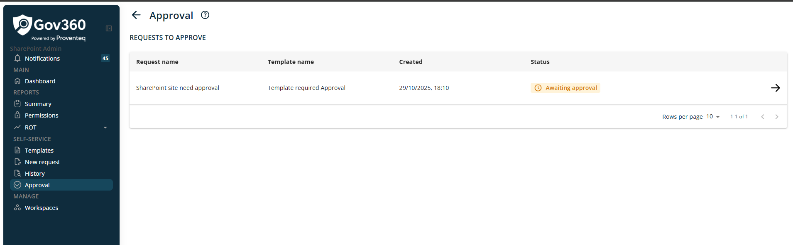
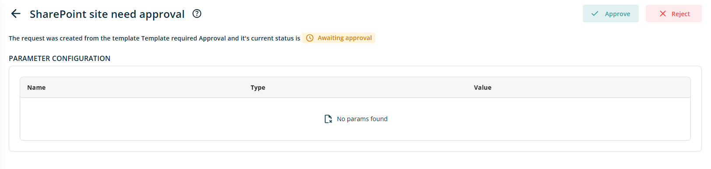

# Approval

When click on Approval from menu, it will show following screen

On request to approve list view, shows all the request where logged in user selected in Reqired Approval list of template. In list view, following columns will be displayed

- **Request Name:** This column will show Name of the provisioning request.

- **Template Name:** This column will show name of the template used to create provisioning request.

- **Created:** This column will show date and time when provisioning request is created.

- **Status:** This column will show status of provisioning. Possible values for this column is following

  - **Awaiting approval:** When request has been generated and not approved or rejected by assigned user.

  - **Approved:** When request has been approved by user.

  - **Rejected:** When request has been rejected by user.

- **Action:** This column will show Arrow icon to open details of request as show below

This screen have two buttons at top right corner of the screen

- **Approve:** When click on Approve button, request set as approved and then it will move for provisioning.

- **Reject:** When click on Reject button, request got rejected and request will not send for furthure processing.

In addition, the bottom right section of the workspace list table provides the following features:

- Rows Per Page: The number of rows displayed per page can be adjusted using a dropdown menu in this section. Available options include 5, 10, 15, 20, 25, 30, 50, and 100 rows per page. The default setting is 10 records per page.

- Total Record Count: This displays the range of records currently shown and the total record count, such as \"0--10 out of 200\".

- Next/Previous Navigation: Users can navigate to the next or previous set of records using the \< and \> arrow icons.
