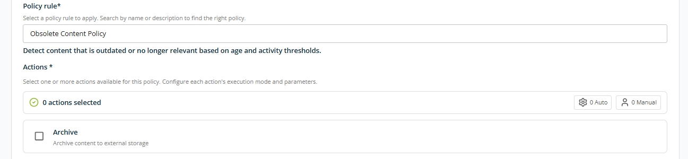
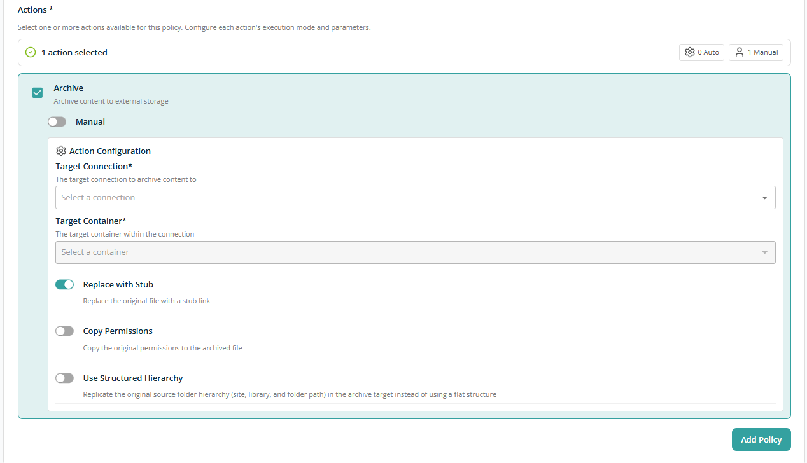
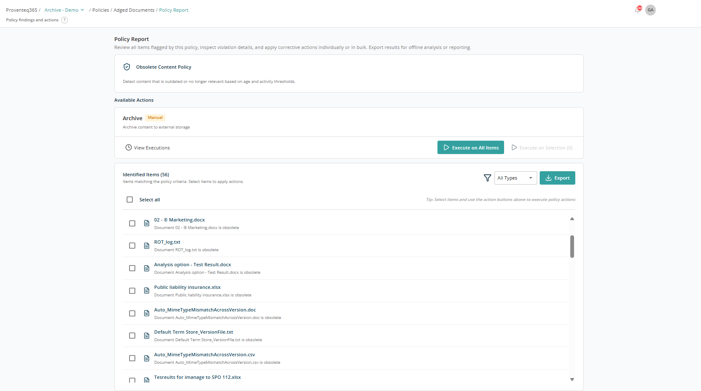
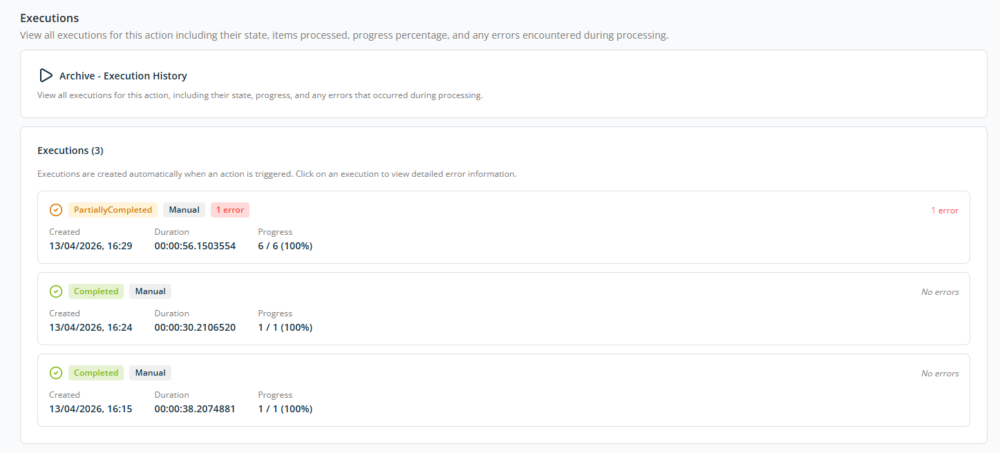
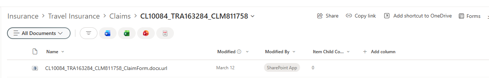
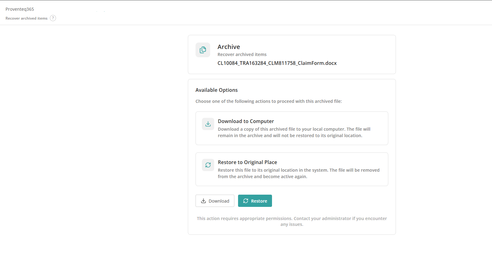

# Archive

The **Archiving** feature in Proventeq365 enables organisations to securely move inactive or low-usage content from **SharePoint** to **Wasabi** storage. This helps reduce storage costs, improve performance in SharePoint, and support long-term data retention requirements.

Archived content remains preserved in Wasabi while being removed or reduced from active SharePoint storage, ensuring data is retained without impacting day-to-day collaboration.

## How Archiving Works

1. Proventeq365 identifies content eligible for archiving based on configured governance policies — the **Obsolete Content Policy**.
2. Based on the obsolete data identification criteria, identified content is transferred to the **Wasabi source system** by manual or automatic action.
3. On successful archiving, the original file is replaced with a **stub link**. Based on the archiving action configuration, original file permissions can be copied to the stub, and the original source folder hierarchy (site, library, and folder path) can be replicated in the archive target instead of using a flat structure.
4. The original file is deleted from the source location after content is archived successfully.

## How to Archive Content

Follow the steps below to archive content from Proventeq365.

### Step 1 — Add a Wasabi Connection

Use the [Connections](../02-manage/connections/README.md) module to add a new Wasabi connection as the archive location.

### Step 2 — Add a Policy

To identify content, an **Obsolete Content Policy** must be configured either when adding a workspace or in an existing workspace. Select **Obsolete Content Policy** in the **Policy rule** dropdown, give the policy a meaningful name, and configure its action using the action configuration section.

Select the **Archive** checkbox as the action to archive content. This reveals additional configuration fields.

**Execution Mode** — Controlled by a toggle displayed below the Archive checkbox. OFF by default.

- **Toggle OFF — Manual** — The action requires user initiation before execution.
- **Toggle ON — Automatic** — The action runs automatically when the policy is executed.

**Action Configuration** — Set the target connection and container, along with archive settings:

- **Target Connection** — The connection representing the external storage system where content will be archived. Example: Wasabi, Azure Blob, or other configured archive sources.
- **Target Container** — The container or bucket within the selected connection where archived content will be stored.
- **Replace with Stub** — When enabled, the original file in the source system is replaced with a stub link pointing to the archived content.
- **Copy Permissions** — When enabled, the original file permissions are copied to the archived content to maintain access controls.
- **Use Structured Hierarchy** — When enabled, archived content retains its original folder structure (site, library, and folder hierarchy) within the target container instead of using a flat structure.

After choosing the relevant settings, click **Add Policy**. The policy runs along with workspace execution or can run separately.

### Step 3 — Archive Content

Once the policy scan runs, click **View** to see the policy report and archive the relevant content.

#### Policy Summary

At the top of the screen, the policy details are displayed:

- **Policy Name** — The governance policy that was executed.
- **Policy Description** — Explains what the policy detects. Example: *Detects content that is outdated or no longer relevant based on age and activity thresholds.*

This section provides context for why the listed items were identified.

#### Available Actions

##### Archive

The **Archive** action is available if it is configured for the policy with **Manual** execution:

- **Execute on all items** — Applies the action to all identified items.
- **Execute on selection** — Applies the action only to selected items.

If the archive action is set to execute Automatically, the **Execute on All Items** and **Execute on Selection** options are not available.

##### View Executions

Use **View Executions** to view the history of policy runs and previously executed actions. Clicking this option opens the following screen:

The **Executions** screen provides a complete history of all executions for a configured action, such as **Archive**. It lets you monitor execution status, track progress, and review any errors encountered during processing.

###### Executions List

The executions list displays all recorded runs with the following details:

- **Execution Status** — Possible values:
  - **Completed** — The action ran successfully with no errors.
  - **Partially Completed** — The action completed but one or more items failed.
- **Execution Mode** — How the action was initiated (for example, Manual).
- **Created** — The date and time when the execution started.
- **Duration** — Total time taken to process all items in the execution.
- **Progress** — Number of items processed out of the total items. Displayed as a count and percentage (for example, 6 / 6 (100%)).
- **Errors** — The number of errors, if any occurred. "No errors" indicates a successful execution. Selecting an execution with errors lets you view error details.

### Step 4 — View Archived Content

After archiving, open the source location to see the stub link. This link is accessible to all users who can access the original file.

When you click the stub URL, you are redirected to a page from where you can download the archived file or restore it if needed.

## Archived File Details

At the top of the screen, the archived item is displayed with:

- **File name** — The name of the archived file.
- **Archive status** — Indicates that the file is currently stored in the archive.

## Available Options

Choose one of the following actions to proceed with the archived file.

### Download to Computer

Click the **Download** button:

- Downloads a copy of the archived file to your local computer.
- The file **remains archived** and is **not restored** to its original location.
- Use this option when you need temporary access to the file without reactivating it.

### Restore to Original Place

Click the **Restore** button:

- Restores the archived file to its original location in the system.
- The file is **removed from the archive** and becomes **active** again.
- Use this option when the file is required for ongoing or renewed use.
