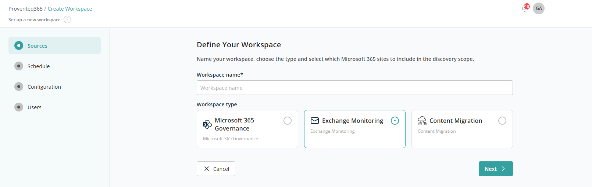
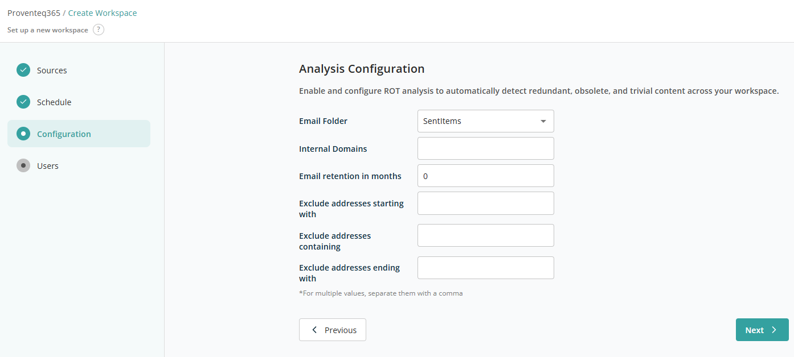

# Create Exchange Monitoring Workspace

When adding a new workspace, choose the **Exchange Monitor** card and click **Next**. You are moved into the Schedule screen:

Scheduling works the same as for the Microsoft 365 Governance workspace type. After scheduling, click **Next** to reach the Configuration screen:

The Configuration screen offers the following options to define how Exchange email data is analysed within the workspace:

- **Email Folder** — Select the email folder to include in the analysis. Only emails stored in the selected folder are evaluated. Example: *Sent Items*.
- **Internal Domains** — Specify one or more internal email domains to differentiate internal from external email communication. Emails associated with these domains are treated as internal. Example: *company.com*.
- **Email Retention in months** — Define how long emails should be retained before being considered for analysis based on age.
  - Enter `0` to apply no retention limit.
  - Enter a value such as `12` to apply a 12-month retention period.
- **Exclude addresses starting with** — Excludes addresses that begin with specific text. Example: *noreply, system*.
- **Exclude addresses containing** — Excludes addresses that contain specific text. Example: *support, admin*.
- **Exclude addresses ending with** — Excludes addresses that end with specific text or domains. Example: `@external.com`.

Upon entering the necessary information, clicking **Next** opens the Users screen. This works the same as for the Microsoft 365 Governance workspace type.

After all required information has been selected, click **Create Workspace** to create the workspace and return to the Dashboard.
