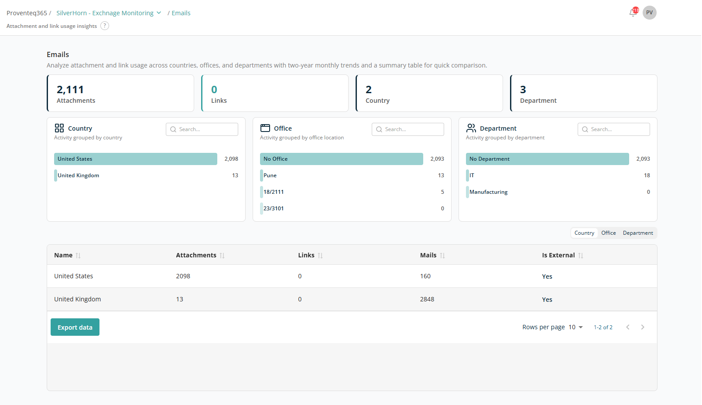

# Email Report

The **Emails** report provides insights into how attachments and links are used in emails across your organisation. It helps you analyse sharing patterns by country, office location, and department, enabling better governance and monitoring of email-based data exchange.

## Overview

The top section provides a quick summary of email activity:

- **Attachments** — Total number of email attachments.
- **Links** — Total number of links shared via email.
- **Country** — Number of countries involved in email activity.
- **Department** — Number of departments included in the analysis.

## Analytical Insights

The section provides visual breakdowns to help you understand email usage patterns:

- **Country** — Email attachments grouped by country. Helps to identify where most email attachments are being shared geographically. Use the **Search** box to locate data by country.
- **Office** — Email attachments grouped by office location. Useful for identifying email activity from specific office locations. Use the **Search** box to locate data by office name.
- **Department** — Email attachments grouped by department. Helps assess department-wise data sharing behaviour. Use the **Search** box to locate data by department name.

Each individual bar shown in a widget is clickable and acts as a filter for the data. Clicking a bar filters the entire report by that selection, and the selected criteria are displayed at the top.

## Data Table

The table provides a comparative summary of email activity. Columns:

- **Name** — The selected grouping (e.g. country, office, or department).
- **Attachments** — Total number of attachments shared via email.
- **Links** — Number of links shared (if applicable).
- **Mails** — Total number of emails sent.
- **Is External** — Whether the emails involve external recipients. `Yes` means those are emails sent to an external domain.

Above the table, three tabs let you view the data by **Country, Office, and Department**. Based on the selected tab, the Name column shows the corresponding value (e.g. if the Country tab is selected, the Name column reflects a value like `United States`).

The table supports sorting on all columns.

The **Export Data** button at the bottom left lets you download the report for offline analysis or reporting.

At the bottom right of the table:

- **Rows Per Page** — 5, 10, 15, 20, 25, 30, 50, or 100. Default: 10.
- **Total Record Count** — Range and total record count.
- **Next/Previous Navigation** — Arrow icons to navigate.
