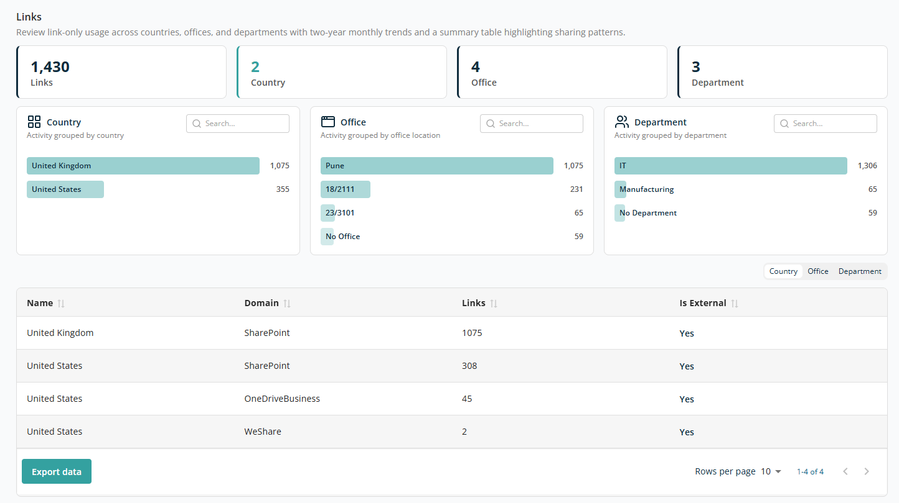

# Link Report

The **Links** report provides insights into how file and resource links are shared via email across your organisation. It helps you analyse link-sharing patterns by country, office location, and department, enabling better monitoring of external access and data exposure risks.

## Overview

The top section provides a quick summary of link activity:

- **Link** — Total number of links shared via email.
- **Country** — Number of countries contributing to link-sharing activity.
- **Office** — Number of office locations involved.
- **Department** — Number of departments contributing to link usage.

## Analytical Insights

The section provides visual breakdowns to help you understand email usage patterns:

- **Country** — Number of links grouped by country. Helps to identify where most links are being shared geographically. Use the **Search** box to locate data by country.
- **Office** — Number of links grouped by office location. Useful for identifying activity from specific office locations. Use the **Search** box to locate data by office name.
- **Department** — Number of links grouped by department. Helps assess department-wise data sharing behaviour. Use the **Search** box to locate data by department name.

Each individual bar shown in a widget is clickable and acts as a filter for the data. Clicking a bar filters the entire report by that selection, and the selected criteria are displayed at the top.

## Data Table

The table provides a comparative summary of link activity. Columns:

- **Name** — The selected grouping (e.g. country, office, or department).
- **Domain** — The platform from which the link originates, e.g. SharePoint, OneDriveBusiness, WeShare.
- **Links** — Number of links shared.
- **Is External** — Whether the emails involve external recipients. `Yes` means those are emails sent to an external domain.

Above the table, three tabs let you view the data by **Country, Office, and Department**. Based on the selected tab, the Name column shows the corresponding value.

The table supports sorting on all columns.

The **Export Data** button at the bottom left lets you download the report for offline analysis or reporting.

At the bottom right of the table:

- **Rows Per Page** — 5, 10, 15, 20, 25, 30, 50, or 100. Default: 10.
- **Total Record Count** — Range and total record count.
- **Next/Previous Navigation** — Arrow icons to navigate.
